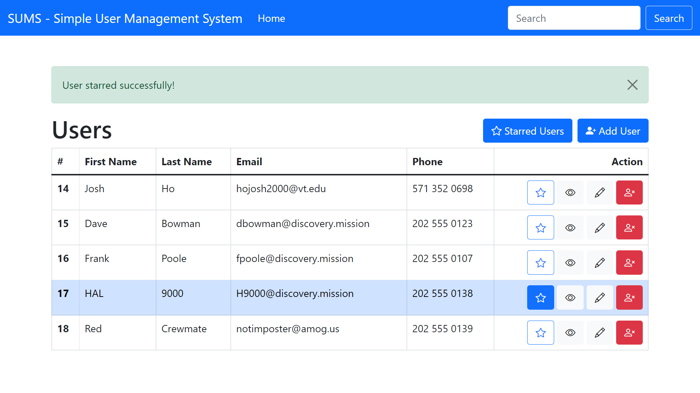

# SUMS - Simple User Manager

SUMS is just that -- a simple user manager. It currently supports:
- Viewing all users in the database
- Searching for users by name
- Adding a user
  - Name, email, phone, and optional comments
- Starring/unstarring a user, and viewing only starred users
- Viewing a user in detail
- Editing a user
- Deleting a user

It is currently not in deployment, but keep an eye out for that :eyes:
